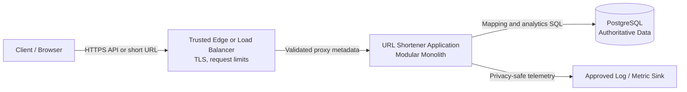
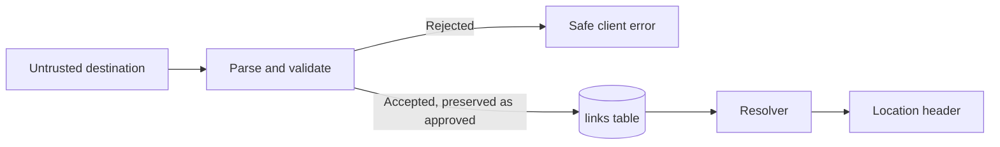
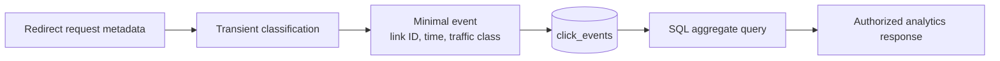

# URL Shortener Architecture

## Document status

- **Status:** PROPOSED — PENDING ENGINEER APPROVAL
- **Scope:** Architecture design only
- **Implementation authorized:** No
- **Source:** `ENGINEERING_PLAN.md`, `TASKS.md`, and `TRACEABILITY.md`

This proposal chooses the smallest architecture that can satisfy the currently normalized requirements. Major choices are recorded as proposed decisions in `DECISIONS.md`; they are not approved merely because they appear here.

REQ-001 through REQ-004 establish the functional and prototype quality baseline. Exact wire schemas remain ARC-002 work, persistence details remain ARC-003 work, and deployment-specific telemetry routing remains ARC-005 work.

## Architecture principles

1. Start with one deployable application and one authoritative relational database.
2. Keep creation, redirect, analytics, and operations as internal modules with explicit boundaries.
3. Use database constraints for correctness instead of distributed coordination.
4. Keep redirect availability independent of analytics success under the proposed fail-open policy.
5. Collect the minimum analytics data needed for the approved report.
6. Add Redis, queues, services, or replicas only when an approved requirement or measured result justifies them.
7. Make external boundaries replaceable and testable without creating speculative internal frameworks.

### Proposed technical stack

| Concern | Proposed choice | Rationale and boundary |
| --- | --- | --- |
| Language/runtime | Java 21 (or the engineer-approved project JDK) | Strong typing and mature Spring ecosystem; the runtime version must match the build environment. |
| Build | Gradle with the existing wrapper and dependency lock | Reproducible builds and no build-tool installation requirement. |
| Application framework | Spring Boot | One deployable HTTP application with configuration, lifecycle, health, and test integration. |
| Persistence | Spring Data JPA/Hibernate against PostgreSQL | Transactional mapping creation, case-sensitive uniqueness, indexed lookup, and analytics range queries. Hibernate is an implementation detail behind repository boundaries. |
| Baseline stateful services | One PostgreSQL datastore | Authoritative mappings and minimal click events; no Redis, Kafka, queue, or second datastore. |
| Deployment | Single-region, single-application-instance prototype | Matches the approved validation envelope; replicas and multi-region operation require a new decision. |

The selected dependency set is intentionally limited to the existing Java/Spring/Gradle foundation plus the approved PostgreSQL/Hibernate persistence path. No dependency is installed by ARC-001. The engineer must approve this proposed stack before project-foundation dependency changes are accepted.

## 1. Component architecture

### Proposed deployment



### Application modules

| Module | Responsibility | Does not own |
| --- | --- | --- |
| HTTP/API | Routing, request decoding, response encoding, status and header mapping | URL policy, persistence, code generation |
| Configuration | Validated environment configuration and secrets references | Business defaults that require product decisions |
| URL policy | Structural URL validation and approved preservation or normalization | Network fetching or destination reputation |
| Link creation | Coordinates validation, token/code generation, and durable mapping creation | HTTP formatting and analytics aggregation |
| Code generator | Produces candidate short codes from an approved secure random source | Uniqueness authority |
| Mapping repository | Authoritative create and lookup operations and error classification | Redirect status or API errors |
| Link resolver | Validates codes and classifies active, unknown, expired, and dependency-failed outcomes | HTTP response formatting |
| Redirect handler | Converts resolution outcomes to the approved HTTP response | Mapping consistency rules |
| Analytics capture | Creates a minimal event at the approved click boundary | Redirect success decision |
| Analytics store/query | Writes minimal events and calculates approved aggregates | Operational metrics and logs |
| Access control | Verifies per-link analytics credentials or another approved identity | Product ownership decisions not yet approved |
| Rate limiter | Enforces approved operation and client limits | Authentication or authorization |
| Observability | Structured logging, bounded metrics, correlation, health signals | Product click analytics |

The modules are logical boundaries inside one process and one repository. They are not independently deployed services.

## 2. Request flow

“Request flow” here means short-link creation.

1. The trusted edge terminates TLS, applies coarse request-size limits, and forwards only approved proxy metadata.
2. The API layer assigns or validates a correlation ID and applies the approved creation rate limit.
3. The request body is decoded under a strict body-size and content-type policy.
4. The URL-policy module parses and validates the destination. It does not fetch the destination.
5. The application generates:
   - a candidate ten-character Base62 short code; and
   - a 256-bit per-link analytics management token under the approved per-link access model.
6. In a database transaction, the repository inserts the mapping and the one-way hash of the analytics token.
7. A unique-code conflict causes a new candidate and bounded retry. No existing row is overwritten.
8. Other database failures produce `503 Service Unavailable`; the API never returns false success or treats an uncertain write as a duplicate.
9. The API returns the proposed `201 Created` response using a configured public base URL. The plaintext analytics token is returned only in this response and is not stored or logged.
10. Operational metrics and privacy-safe logs record the outcome without the raw destination, management token, or client IP.

### Duplicate and retry behavior

The proposed baseline creates a new mapping for each ordinary request, even when the destination already exists. Creation is non-idempotent until a separate idempotency policy is approved. This avoids destination-based information leakage and avoids coupling unrelated links' expiration and analytics, but a client that retries after losing a success response may create another link.

If retry-safe creation becomes required, add an explicit idempotency-key contract scoped to an approved client identity. Do not implement destination deduplication as implicit idempotency.

## 3. Redirect flow

1. The edge forwards `GET /{code}` to the application. Static API and health routes take precedence over the fixed-length code route.
2. The HTTP layer rejects codes that do not match the approved format before a database or cache lookup.
3. The repository queries PostgreSQL by the case-sensitive short code; the baseline has no cache lookup.
4. The resolver distinguishes:
   - active mapping;
   - unknown mapping;
   - dependency failure.
5. For an active mapping, the analytics module attempts a minimal best-effort event insert with a bounded time budget.
6. Analytics success or failure is recorded operationally. Under the approved fail-open policy, analytics failure does not block the redirect.
7. The handler returns `302 Found` with the stored destination in `Location` and `Cache-Control: no-store`.
8. Unknown or malformed codes return `404 Not Found` without `Location`; database failure returns `503 Service Unavailable`.

The service counts reaching the analytics-capture step for an active mapping as the approved click boundary. It does not claim that the client reached the destination.

## 4. Data flow

### Destination data



- Raw destinations are stored only because redirect behavior requires them.
- Destinations are not emitted to logs, metrics, traces, or analytics events.
- The service performs no DNS resolution, reachability check, preview, crawl, or malware scan.
- If deletion is later approved, mapping, analytics, cache, and backup semantics require a separate decision.

### Analytics data



- Raw IP addresses are used transiently only if required for rate limiting and are not stored in analytics.
- Raw user-agent and referrer values are not stored in the proposed baseline.
- Bot classification may inspect a user-agent transiently, then store only `suspected_bot` or `unknown`.
- Analytics tokens are stored only as cryptographic hashes.
- Operational telemetry and product analytics use different schemas and access paths.

## 5. Database design

### Baseline database

PostgreSQL is the only baseline stateful dependency. It provides the durable transaction, atomic uniqueness, case-sensitive lookup, foreign-key integrity, and indexed time-range query behavior required by the approved prototype envelope.

SQLite is simpler locally but has different concurrency and deployment behavior. A document database provides no advantage for the fixed mapping/event relationships. Multiple specialized datastores would add cross-store consistency and operational cost without an approved requirement.

### `links` table

| Column | Proposed PostgreSQL type | Nullability/source | Purpose, constraints, and retention |
| --- | --- | --- | --- |
| `id` | `BIGINT GENERATED BY DEFAULT AS IDENTITY` | Not null; database-generated | Internal primary key and foreign-key target; never exposed as the short code; retained for the prototype environment lifetime. |
| `short_code` | `VARCHAR(10)` with binary/case-sensitive comparison | Not null; application-generated | Public identifier; `CHECK` for exactly ten Base62 characters and a unique index; collision authority is the database. |
| `destination_url` | `TEXT` | Not null; validated application input | Exact accepted destination; `CHECK (char_length(destination_url) <= 4096)`; no URL normalization or fetch; retained with the mapping. |
| `analytics_token_hash` | `BYTEA` | Not null; application-generated SHA-256 digest | Per-link analytics credential verifier; `CHECK (octet_length(analytics_token_hash) = 32)`; plaintext is never stored; retained with the mapping. |
| `created_at` | `TIMESTAMPTZ` | Not null; application UTC clock at durable write | Creation timestamp for operations and future lifecycle work; retained with the mapping. |

The baseline deliberately has no `expires_at`, disabled/status, mutable-destination, owner, tenant, idempotency-key, or deletion-state column. Those capabilities require a new requirement and compatibility decision. The short-code uniqueness constraint must use a case-sensitive comparison independent of database default collation.

Indexes and constraints:

- Primary key on `id`.
- Unique case-sensitive index on `short_code`.
- Check constraints for Base62 code shape, URL length, and token-hash length.
- No destination-URL index because duplicate destinations are independent mappings and destination lookup is not an API operation.

### `click_events` table

| Column | Proposed PostgreSQL type | Nullability/source | Purpose, constraints, and retention |
| --- | --- | --- | --- |
| `id` | `BIGINT GENERATED BY DEFAULT AS IDENTITY` | Not null; database-generated | Internal event key; not exposed; retained with the event. |
| `link_id` | `BIGINT` | Not null; foreign key from the resolved mapping | Associates the event with `links.id`; `ON DELETE RESTRICT` is proposed because mapping deletion is outside the baseline. |
| `occurred_at` | `TIMESTAMPTZ` | Not null; application UTC clock at the click boundary | Event time for retention and inclusive-start/exclusive-end daily aggregation; physically delete at or beyond the 90-day boundary within 24 hours. |
| `traffic_class` | `VARCHAR(24)` or constrained enum | Not null; transient classifier output | Only `suspected_automated` or `unclassified`; never represents verified human identity. |

Use a composite index on `(link_id, occurred_at)` for authorized link-and-time-range queries and a retention-supporting index on `occurred_at` if cleanup plans require it. Store no IP, user-agent, referrer, destination, cookie, correlation ID, geographic value, or analytics token in this table.

### Transactions, consistency, and schema evolution

- Creation uses one transaction for the mapping row and token hash. The response is emitted only after durable commit.
- Code uniqueness is resolved by the unique constraint, not a pre-insert existence query. Only a recognized unique-code conflict may trigger the approved candidate retry.
- Analytics insertion is a separate bounded transaction and never controls redirect success.
- Analytics queries read committed events from one datastore snapshot and may omit an immediately preceding event; no exactly-once or read-your-click guarantee is made.
- Versioned migration artifacts must be reviewed before execution. Hibernate schema auto-creation or destructive auto-update is not permitted; runtime schema validation is preferred.
- Migrations must be forward-compatible where practical, execute with explicit preconditions, and provide a tested roll-forward or reversible step. Production backup/restore rollback claims are deferred by RDR-004.

## 6. Short-code generation strategy

### Proposed strategy

- Generate ten characters from `0-9`, `A-Z`, and `a-z` using a cryptographically secure random source.
- Preserve case through routing, proxies, database collation, and lookup.
- Avoid modulo bias through an approved library or rejection-sampling implementation.
- Attempt the insert directly; on the specific unique-code constraint violation, generate a new candidate.
- Stop after five attempts and return an internal availability error. The ten-character length and five-retry bound are approved for the one-million-mapping prototype envelope.
- Never overwrite, update, or lock the row that already owns a code.

Ten Base62 characters provide `62^10`, approximately `8.39 × 10^17`, possible codes and about 59.5 bits of code-space entropy. The unique constraint remains mandatory because probability is not a correctness mechanism.

### Alternatives

| Option | Advantages | Costs and risks | Assessment |
| --- | --- | --- | --- |
| Random Base62 | Decentralized generation, non-sequential, simple horizontal scaling | Requires collision handling; case must be preserved | Proposed baseline |
| Encoded database ID | Collision-free and short | Predictable and enumerable; exposes volume; couples code to storage | Rejected for current security posture |
| Hash of destination | Stable deduplication | Conflicts with proposed duplicate semantics; collision and canonicalization complexity; information leakage | Not proposed |
| UUID in URL | Built-in library support and negligible collision risk | Long links undermine the product goal | Not proposed |
| Separate ID service | Global control at very high scale | New network hop, service, availability domain, and operations | Not needed |

## 7. Redis usage

### Baseline decision

Redis is **not required in the baseline**. The approved single-instance scale envelope does not justify another stateful dependency.

### Conditional cache use

If performance validation shows PostgreSQL lookup cannot meet the approved redirect objective, use Redis as a cache-aside optimization:

- Key: a namespaced short-code value, without raw destination in the key.
- Value: destination plus authoritative expiration time and only other fields required for resolution.
- Positive entries only initially; do not negative-cache unknown codes without a separate decision.
- TTL: the smaller of the approved cache TTL and remaining link lifetime.
- On miss or Redis error: query PostgreSQL.
- PostgreSQL remains authoritative.
- Because baseline links are immutable, ordinary invalidation is unnecessary. Any future disable, delete, or edit feature must add explicit invalidation.
- During PostgreSQL outage, serving a cache hit requires a separate stale-read availability decision; it is not automatically enabled.

### Conditional distributed rate-limit use

For one application instance, a bounded in-memory token bucket is simplest. If multiple instances require a strict shared limit, Redis can provide an atomic token bucket using an approved server-side operation and expiring keys. Rate-limit identity should be an HMAC or other approved pseudonymous derivation rather than a raw IP in the key.

Redis is not proposed as the source of truth, primary analytics store, distributed lock manager, or baseline event queue.

## 8. Analytics architecture

### Approved baseline translated into architecture

Analytics remains a module within the main application and uses the same PostgreSQL database.

1. The resolver identifies an active link.
2. The event-capture module creates a minimal event with link ID, UTC time, and approved traffic class.
3. The application attempts a bounded append-only insert.
4. If the insert succeeds, the event becomes queryable.
5. If it fails or exceeds its small approved time budget, the application increments an operational loss/failure metric and still redirects.
6. The analytics endpoint verifies the per-link management token and queries counts for the approved time range and buckets.

This design is best-effort, not exactly once. It favors a small architecture and redirect availability. The synchronous insert adds one database write to a successful redirect; performance validation must measure that cost.

### Evolution path

If analytics write overhead fails the redirect objective, first consider a bounded in-process batcher, accepting documented crash loss. If durability requirements reject that loss, consider a PostgreSQL outbox or a small durable queue. Kafka is considered only if sustained event scale, independent consumers, retention/replay requirements, or organizational infrastructure justify it.

### Why no separate analytics service

A separate service does not remove the need for event delivery, storage, privacy, or failure semantics. At current scope it adds deployment, authentication, versioning, network failure, observability, and local-development complexity. The internal module boundary preserves a future extraction seam without paying those costs now.

### ARC-004 guarantees and boundaries

| Concern | Baseline guarantee | Explicit limitation |
| --- | --- | --- |
| Click boundary | One event attempt for each successful `GET` that resolves an active mapping, immediately before the redirect response | Does not prove destination arrival or unique-human activity |
| Delivery | Append-only PostgreSQL insert is attempted once within a bounded time budget | No retry, queue, buffering, or exactly-once guarantee; timeout outcomes are operationally ambiguous |
| Redirect availability | Analytics failure is fail-open and never changes an otherwise successful `302` response | Event loss is accepted and must be visible through operational metrics |
| Consistency | Successful inserts are queryable from the same authoritative datastore; analytics queries read one committed snapshot | A query may omit a just-committed event; no read-your-click guarantee |
| Privacy boundary | User-agent classification and rate-limit identity are transient; only link ID, UTC timestamp, and coarse traffic class are persisted | No raw IP, user-agent, referrer, destination, token, or correlation ID in product analytics |
| Retention | Events are eligible for physical deletion at or beyond 90 days, with cleanup monitored within the approved window | Backup retention and production deletion guarantees remain deferred |
| Processing shape | Synchronous bounded capture plus direct SQL aggregation in the modular monolith | Separate consumers, replay, and independent scaling are not baseline capabilities |

## 9. Rate limiting approach

### Approved baseline translated into architecture

- Apply limits to link creation and analytics retrieval because they are resource-intensive and abuse-sensitive.
- Do not apply an application-level redirect quota in the single-instance baseline; coarse edge protection may still apply.
- For a single application instance, use a bounded in-memory token bucket with expiring entries.
- Derive client identity only from the direct peer or trusted proxy chain configured by the operator.
- Use the direct peer or explicitly trusted proxy identity, derive a keyed pseudonymous in-memory key, and expire idle state after 15 minutes. Never persist or log raw IP.
- Return `429 Too Many Requests` and `Retry-After` when the approved limit is exceeded.
- Use capacity 20/refill 10 per minute for creation and capacity 60/refill 60 per minute per analytics token, with bounded `Retry-After`; multi-instance enforcement requires a new decision.

### Scaling tradeoff

In-memory limiting is simple and has no network dependency, but it resets on restart and is per-instance. If strict global limits across replicas are required, move the token-bucket state to Redis or an approved edge gateway. Database-backed request limiting is not proposed because it adds load and contention to the authoritative mapping database.

## 10. Error handling

### Error model

API errors use one envelope:

```json
{
  "error": {
    "code": "STABLE_MACHINE_CODE",
    "message": "Safe human-readable summary",
    "requestId": "correlation-id",
    "details": []
  }
}
```

- `code` is stable and documented.
- `message` does not include stack traces, SQL, dependency addresses, secrets, tokens, or complete destinations.
- `details` is optional and limited to safe field-level validation information.
- `requestId` supports operations without exposing internal trace data.

### Proposed status mapping

| Condition | HTTP status | Notes |
| --- | --- | --- |
| Creation succeeds | `201 Created` | Mapping is durable before response |
| Malformed JSON or URL | `400 Bad Request` | Safe field-level validation only |
| Unsupported content type | `415 Unsupported Media Type` | Creation API |
| Body too large | `413 Payload Too Large` | Rejected before full decode |
| Missing analytics credential | `401 Unauthorized` | Includes appropriate authentication challenge if applicable |
| Invalid analytics credential | `403 Forbidden` | Enumeration behavior requires final review |
| Unknown code | `404 Not Found` | Not used for database outage |
| Expired code | `410 Gone` | Conditional on expiration approval |
| Rate limit exceeded | `429 Too Many Requests` | Include `Retry-After` |
| Mapping database unavailable | `503 Service Unavailable` | May include bounded `Retry-After` |
| Internal or generation exhaustion | `500 Internal Server Error` | Operational detail only in safe logs |

Analytics insert failure is not returned to a redirecting client under the proposed fail-open policy. It is captured through operational metrics and logs.

## 11. Observability

### Metrics

Planned bounded metrics include:

- requests and duration by normalized route, method, status class, and outcome;
- creation success, validation rejection, collision retry, and datastore failure;
- redirect active, unknown, rate-limited, and dependency-failed outcomes (expired and disabled states are absent from the baseline);
- database query duration, timeout, error, and connection-pool saturation;
- no cache metrics in the baseline (Redis metrics only if a later decision approves Redis);
- analytics event attempted, stored, failed, timed out, and queried;
- rate-limit allow and reject counts;
- readiness and process lifecycle state.

Short codes, URLs, IP addresses, tokens, request IDs, and user agents must not be metric labels.

### Logs

- Structured logs include timestamp, severity, service version, operation, safe outcome, and correlation ID.
- Logs exclude destination URLs, analytics tokens, raw IP addresses, raw referrers, raw user agents, SQL values, and secrets by default.
- Expected client errors use lower severity than dependency or invariant failures.
- Collision retries are metrics-first; logs must be sampled or aggregated to prevent noise.

### Tracing

In-process correlation is required. Distributed tracing is not a baseline dependency because there is one service. OpenTelemetry or another tracing dependency may be added if deployment or diagnosis needs justify it.

### Health and alerts

- Liveness indicates that the process can execute, not that every dependency is available.
- Readiness indicates that the instance can safely serve approved traffic; PostgreSQL is expected to be required in the no-cache baseline.
- Alerts cover the RDR-004 thresholds for unexpected 5xx, latency, readiness, datastore failures, analytics loss, rate limiting, collision retries/exhaustion, saturation, and analytics deletion lag. Routing and ownership remain deployment-specific.
- OBS-IMPL-001 in `TASKS.md` owns implementation and synthetic validation of these metrics and alerts.

## 12. Security boundaries

| Boundary | Trust rule | Principal controls |
| --- | --- | --- |
| Client to edge | All requests, URLs, codes, headers, and tokens are untrusted | TLS, request-size limits, method and content-type enforcement, coarse abuse controls |
| Edge to application | Only configured edge addresses are trusted to supply forwarding metadata | Trusted-proxy allowlist, forwarded-header validation, configured public base URL |
| API to domain modules | Decoded values remain untrusted until domain validation succeeds | Typed validation results, length and character limits, no implicit normalization |
| Application to PostgreSQL | Database is authoritative but can fail or return no row | Parameterized operations, least privilege, TLS if networked, bounded timeouts, error classification |
| Application to Redis | Optional cache/limit state is non-authoritative and may be stale or unavailable | Namespaced keys, authenticated private access, bounded TTL, fallback policy |
| Application to telemetry | Telemetry destination is not allowed to receive product secrets or personal data | Field allowlist, redaction, bounded labels, access and retention controls |
| Analytics caller to API | Possession of a public short URL does not automatically authorize analytics | Proposed per-link management token, hash storage, constant-time verification, rate limits |

### Proposed analytics credential

To avoid introducing user accounts while protecting analytics, creation returns a random 256-bit management token once. The database stores only its SHA-256 hash. Analytics calls send the token in the `Authorization` header. Tokens are never accepted in query strings, logged, or returned again.

Tradeoffs: this is simpler than accounts and tenants, but a lost token cannot be recovered, sharing is bearer-based, and rotation needs a future management capability. The engineer must approve this model or choose another access design before API implementation.

### Explicit security exclusions

- A short code is not an authorization credential.
- Random codes reduce casual enumeration but do not make destination links private.
- Bot classification is heuristic and does not establish a human identity.
- No server-side destination fetch is permitted without a separate SSRF threat model and approval.
- The baseline is not a full phishing, malware, or abuse moderation platform.

## 13. Testing architecture

### Test layers

| Layer | Purpose | Examples |
| --- | --- | --- |
| Unit and property | Validate pure rules and invariants quickly | URL matrix, code format and collision retry, lifecycle boundaries, traffic classification, error mapping |
| Component | Exercise a module with controlled external boundaries | Creation orchestration, resolver outcomes, analytics insert failure, rate token bucket |
| Integration | Validate the real selected datastore and optional Redis | Constraints, transactions, migrations, SQL aggregation, cache TTL and outage |
| API contract | Prove documented wire behavior | Status, headers, schemas, auth, rate limits, error envelope |
| Concurrency | Prove correctness under simultaneous work | Unique insertion, duplicate requests, lookup during lifecycle boundaries |
| Fault injection | Prove approved degradation | Database timeout/outage, analytics failure, Redis failure, shutdown with work in flight |
| Security and privacy | Exercise threat cases and data boundaries | Scheme bypass, header injection, oversized input, token access, proxy spoofing, telemetry scans |
| Performance | Validate approved SLOs and infrastructure need | Mixed creation/redirect/analytics load at approved cardinality |

### Test seams

Use narrow replaceable boundaries only where control is required:

- approved clock for expiration and time buckets;
- approved secure random source for deterministic collision tests;
- mapping and analytics repositories at the database boundary;
- optional cache and rate-limit store boundary;
- telemetry capture sink for schema and redaction assertions.

Production behavior must be validated against real PostgreSQL integration tests, not only mocks. Optional Redis behavior must be tested against the approved Redis version if introduced. Tests use synthetic destinations and must not make external network requests.

### Validation environments

- Unit tests require no external services.
- Integration tests use isolated, disposable database state and least-privileged test credentials.
- Fault tests run only against isolated test dependencies.
- Performance tests require a documented environment, seeded cardinality, warm-up, duration, concurrency, percentiles, and cleanup plan.
- Clean-environment validation is the final source of reproducibility evidence.

## Major architecture evaluations

| Candidate | Current need | Advantages | Costs and risks | Proposed decision |
| --- | --- | --- | --- | --- |
| Kafka | No approved event rate, replay, multi-consumer, or retention need requires it | Durable high-throughput stream, replay, consumer independence | Cluster operations, schemas, delivery semantics, local setup, monitoring, cost | Do not use |
| Microservices | Domain and team scale do not require independent deployment | Independent scaling and ownership | Network failures, auth, versioning, deployment and observability multiplication | Use a modular monolith |
| Separate analytics service | Analytics is small and shares mapping identity and storage | Independent scaling and failure domain | Requires delivery protocol, deployment, auth, versioning, and more operations | Keep analytics as an internal module |
| Separate ID-generation service | Random generation needs no central sequence | Central allocation at extreme coordinated scale | New critical network dependency and availability problem | Generate codes in application instances |
| Distributed locking | Database uniqueness and Redis atomic operations cover identified races | General cross-node mutual exclusion | Lease expiry, deadlocks, split brain, latency, difficult failure testing | Do not use |
| Redis | No approved baseline latency or replica coordination need | Fast cache and shared rate-limit state | Additional stateful dependency, stale data, outage and operational complexity | Defer; add only on evidence |
| PostgreSQL outbox | No approved durable analytics-delivery guarantee yet | Durable handoff without Kafka | More tables, polling, cleanup, delivery duplication | Defer until loss tolerance requires it |
| In-process analytics queue | Could reduce redirect write latency | Simple batching without external system | Process-crash loss, backpressure and shutdown complexity | Not baseline; consider after measurement |

## Evolution triggers

Architecture expansion requires a measured or approved trigger:

| Trigger | First response to evaluate |
| --- | --- |
| PostgreSQL lookup misses redirect latency target | Query/index analysis, then cache-aside Redis if evidence supports it |
| Multiple replicas require strict global rate limits | Redis or approved edge-level shared limiter |
| Analytics insert exceeds redirect overhead | In-process batching if crash loss is acceptable; otherwise PostgreSQL outbox |
| Analytics volume makes query aggregation too slow | Time-bucket aggregate table or partitioning before a new service |
| Multiple independent event consumers and replay are required at high sustained volume | Evaluate a durable stream, including Kafka, with measured capacity needs |
| Team or deployment ownership requires independent analytics releases | Re-evaluate service extraction using the existing module boundary |
| Multi-region active-active becomes required | Revisit code-space, data ownership, replication, consistency, routing, and recovery as a new architecture decision |

## Approval gate

Before project-foundation implementation, the engineer must approve, modify, or reject the ARC-001 proposals in `DECISIONS.md`. ARC-002, ARC-003, ARC-004, and ARC-005 remain subsequent architecture gates; no source implementation or dependency installation is authorized by this document.
